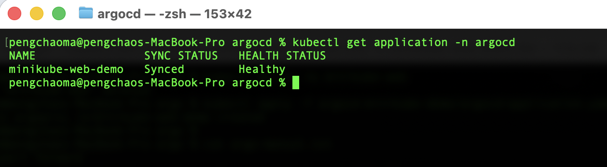
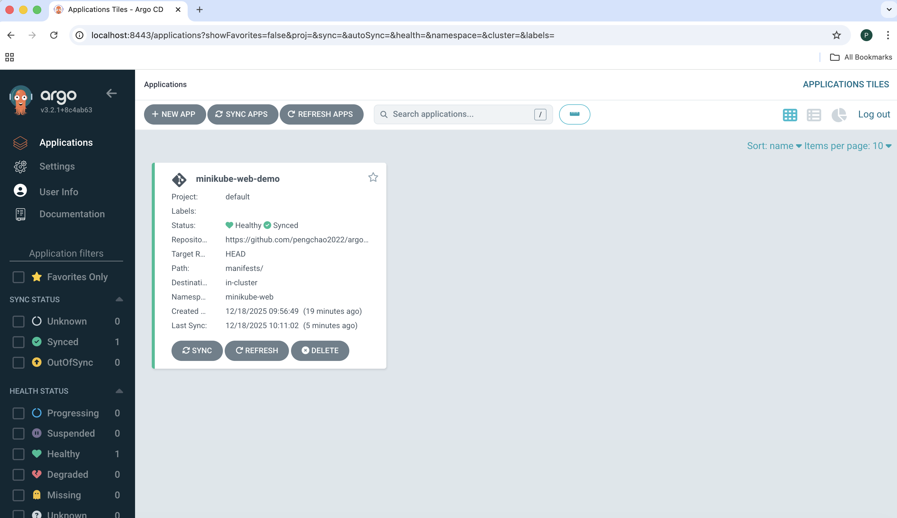
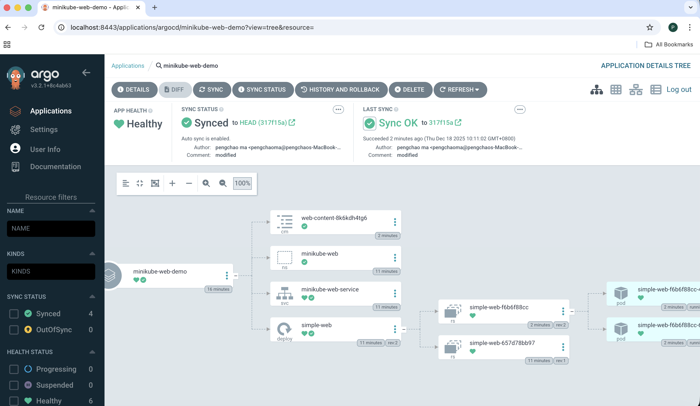
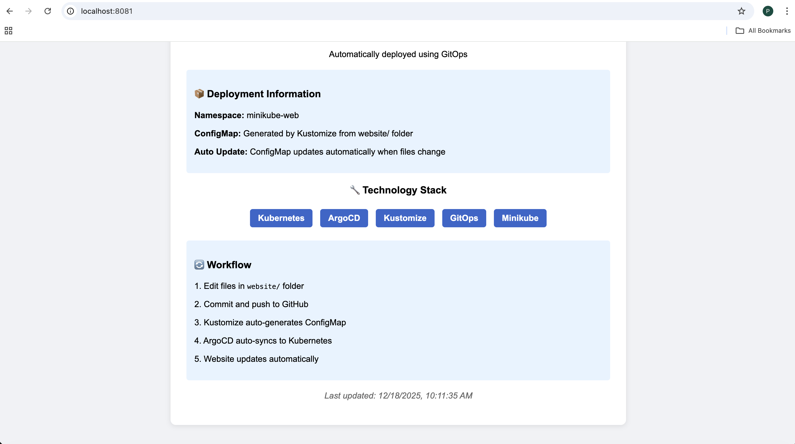

# Argocd-minikube-demo

In this demo, I will show you how to create an application using argocd

## Features

- argocd automatically sync the code from github repo

- use the kustomization to generate the configmap 

- argocd application.yaml with github repo and minikube server URL

- Use kubectl to deploy the application

```shell
kubectl apply -f argocd/application.yaml -n argocd
```

- using the port-forword so that you can vist the argo console from localhost

    - kubectl port-forward svc/argocd-server -n argocd 8888:443
    - kubectl port-forward svc/minikube-web-service -n minikube-web 8081:80


- using the kubectl command to check the application status
```shell
kubectl get application -n argocd
```
- screenshot looks like:



## Usage

- Here's the application in argo looks like



- Here's the pods in argo looks like



- Here's the website in argo looks like

